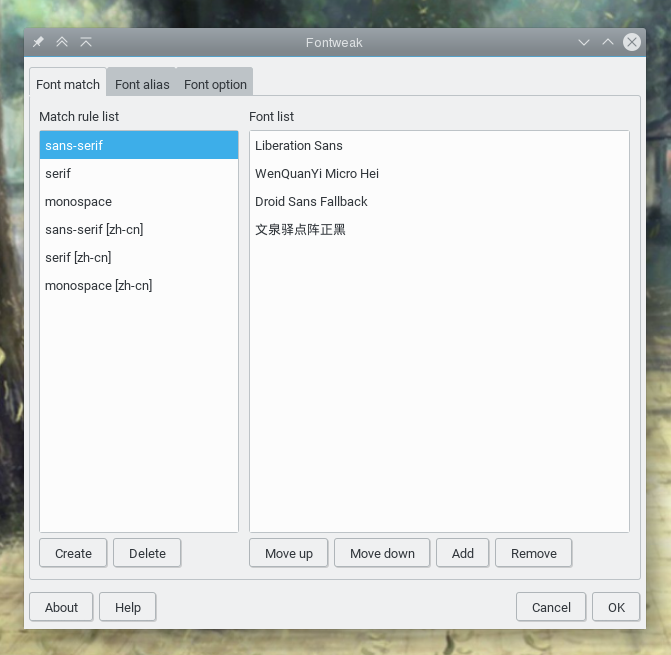

# Fontweak

A front-end for fontconfig. Setup perfect font effects, fast and easily.

## Download

- [CentOS, Fedora, openSUSE, RHEL, SUSE](https://software.opensuse.org/download.html?project=home%3Aguoyunhebrave&package=fontweak)

- [Debian, Ubuntu, Linux mint](https://software.opensuse.org/download.html?project=home%3Aguoyunhebrave&package=fontweak)

- [Arch Linux](https://software.opensuse.org/download.html?project=home%3Aguoyunhebrave&package=fontweak)

- [Other Linux distributions](https://github.com/guoyunhe/fontweak/releases)

## Get Help and Report problems

<https://github.com/guoyunhe/fontweak/issues>

## Document and Tips

<https://github.com/guoyunhe/fontweak/wiki>

## License

GNU GENERAL PUBLIC LICENSE version 3 or later.

## Author

Guo Yunhe guoyunhebrave@gmail.com https://guoyunhe.me/
